# Geo-SPRITE Visual Maps for AP European History

20 visual concept maps using Mermaid diagrams and markdown tables. These maps show how Geo-SPRITE lenses interact within and across AP units.

---

## Map 1: Geo-SPRITE Wheel (Central Concept Map)

The seven lenses and how they connect to each other. Every historical event can be analyzed through multiple lenses simultaneously.

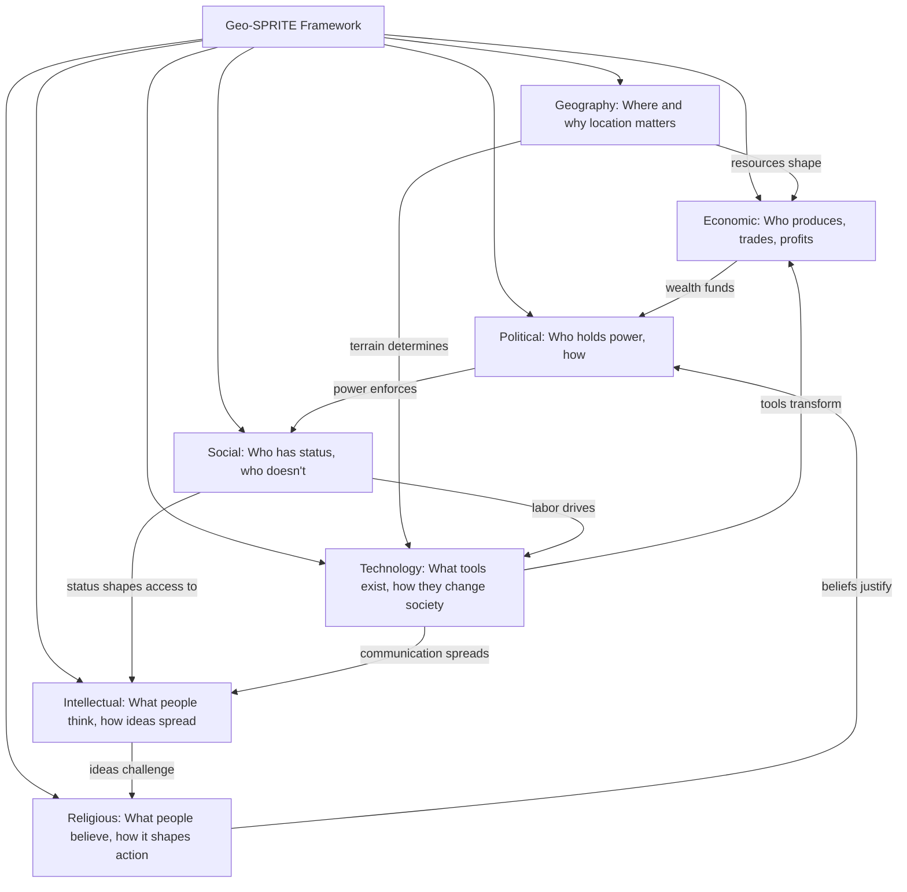

**Key insight:** No lens operates in isolation. The strongest AP essays show how two or three lenses interact to produce a historical outcome.

---

## Map 2: Renaissance Geo-SPRITE (Dominant Lenses)

Which lenses dominate the Italian Renaissance, and which are secondary.

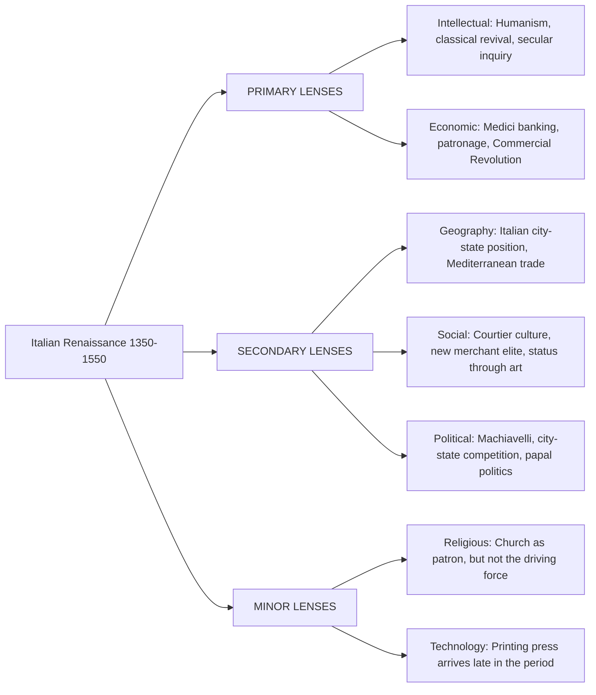

| Lens | Dominance | Example Evidence | Common Misuse |
|------|-----------|-----------------|---------------|
| Intellectual | Primary | Petrarch, Pico, humanism | Calling humanists atheists |
| Economic | Primary | Medici patronage, banking | Ignoring that most people were poor |
| Geography | Secondary | City-state trade positions | Treating all city-states as identical |
| Social | Secondary | Castiglione's courtier ideal | Projecting elite culture onto all classes |
| Political | Secondary | Machiavelli's The Prince | Reducing to "ends justify means" |
| Religious | Minor | Church patronage of art | Calling the Renaissance anti-religious |
| Technology | Minor | Printing press (late period) | Overstating Gutenberg's role in the Renaissance |

---

## Map 3: Reformation Geo-SPRITE

How the Reformation activates nearly every lens simultaneously.

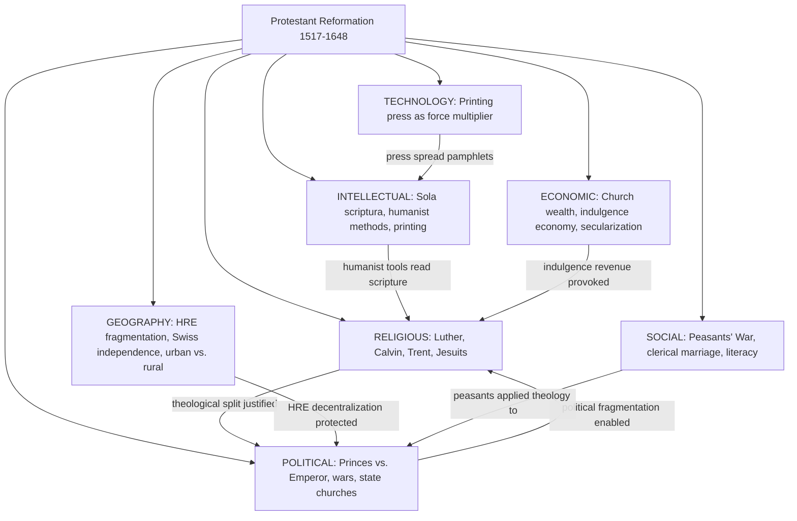

**Key insight:** The Reformation is uniquely "full-spectrum" in Geo-SPRITE terms. The AP loves it for comparison and causation prompts because every lens is active.

---

## Map 4: Absolutism vs. Constitutionalism

Side-by-side Geo-SPRITE comparison of two political models emerging in the 17th century.

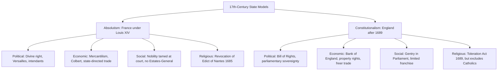

| Lens | Absolutism (France) | Constitutionalism (England) |
|------|--------------------|-----------------------------|
| Political | King rules by divine right; no legislature meets | Parliament controls taxation and legislation |
| Economic | State-directed mercantilism under Colbert | Emerging free market; Bank of England (1694) |
| Social | Nobles trapped at Versailles, politically neutered | Gentry govern locally; limited but real representation |
| Religious | Catholic uniformity enforced; Huguenots expelled | Toleration Act, but Catholics and dissenters restricted |
| Intellectual | Censorship; Academie Francaise controls culture | Locke publishes Two Treatises; freer press |
| Geography | Large continental state requiring centralized army | Island nation; navy over army; harder to invade |
| Technology | Versailles as political technology of control | Financial instruments (national debt, stock markets) |

---

## Map 5: Scientific Revolution to Enlightenment Chain

How ideas built on each other across the two movements.

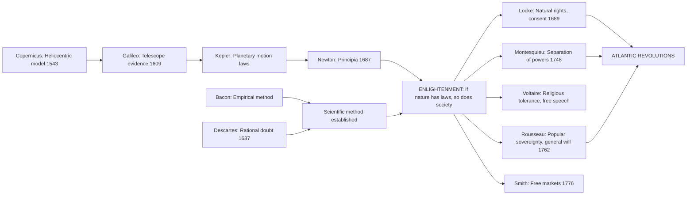

**Key insight:** The chain runs: empirical observation challenges authority (Science) --> reason can discover laws governing society (Enlightenment) --> existing political arrangements are not divinely ordained (Revolution).

---

## Map 6: French Revolution Geo-SPRITE Explosion

How the French Revolution activates all seven lenses in rapid succession.

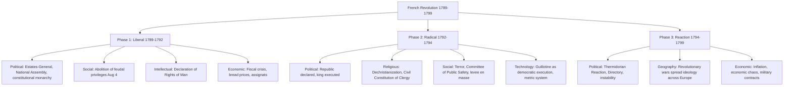

**Key insight:** The Revolution is the single best AP topic for showing how lenses interact. Economic crisis triggers political upheaval, which unleashes social transformation, which provokes religious conflict, all while intellectual ideas provide justification.

---

## Map 7: Industrial Revolution Transformation

Before-and-after across all Geo-SPRITE lenses.

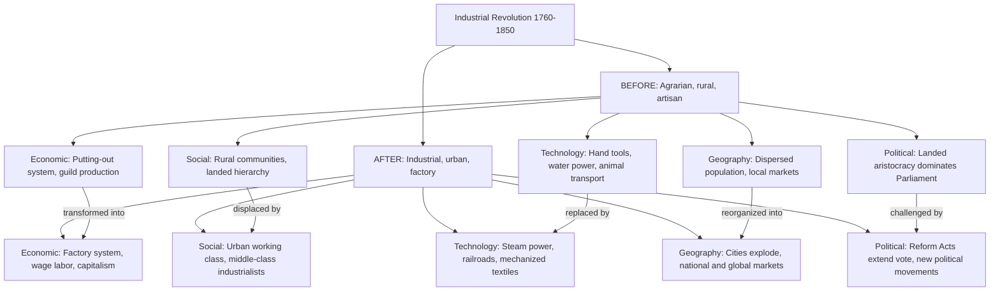

| Lens | Pre-Industrial | Post-Industrial | CCOT Angle |
|------|---------------|-----------------|------------|
| Economic | Agrarian, guild-based | Capitalist, factory-based | Continuity: inequality persisted, just in new forms |
| Social | Rural, hierarchical by birth | Urban, class-based by wealth | Continuity: elites still dominated, but elite identity changed |
| Technology | Hand tools, animal power | Steam, iron, mechanization | Change: qualitative break in production capacity |
| Geography | Local markets, dispersed | National/global markets, concentrated | Change: urbanization rate unprecedented |
| Political | Aristocratic control | Gradual democratization | Continuity: property requirements for voting persisted decades |

---

## Map 8: Nationalism Evolution (Liberal to Ethnic)

How nationalism changed character across the 19th century.

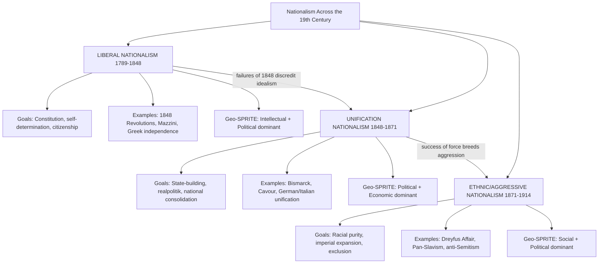

---

## Map 9: Imperialism Cause Map

Multiple causes feeding into European imperialism, organized by Geo-SPRITE lens.

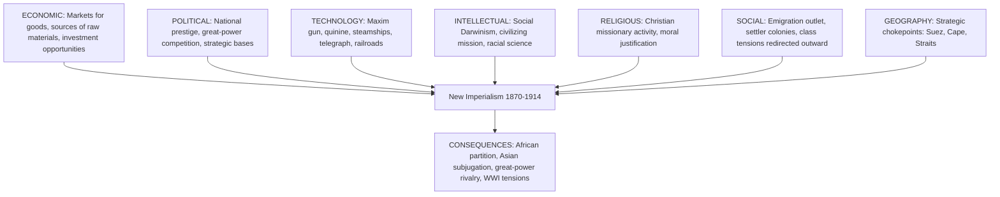

| Cause Category | Specific Evidence | Weight in AP Essays |
|---------------|-------------------|-------------------|
| Economic | Hobson's theory of surplus capital; rubber, diamonds, oil | High: graders expect economic analysis |
| Political | Berlin Conference 1884-85; Fashoda Crisis 1898 | High: geopolitical competition is central |
| Technology | Maxim gun; quinine prophylaxis; steamships | Medium: explains HOW, not WHY |
| Intellectual | Social Darwinism; Kipling's "White Man's Burden" | Medium: justification, not root cause |
| Religious | Missionary societies; Livingstone | Lower: supporting, not primary |
| Social | Settler colonies; emigration pressure | Lower: context, not driver |
| Geography | Suez Canal; Cape route; naval bases | Medium: explains WHERE, not WHY |

---

## Map 10: WWI Causation

The layered causes of World War I.

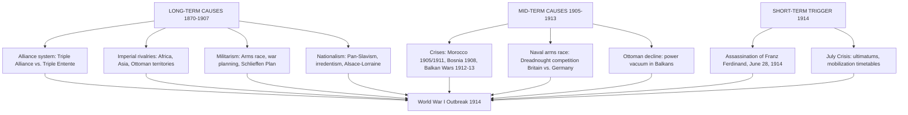

**Key insight for AP essays:** Long-term causes explain WHY Europe was a powder keg. The short-term trigger explains WHEN it exploded. Strong essays distinguish between the two.

---

## Map 11: Fascism / Nazism / Stalinism Comparison

Three totalitarian systems compared across Geo-SPRITE lenses.

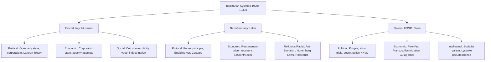

| Lens | Fascist Italy | Nazi Germany | Stalinist USSR |
|------|--------------|--------------|----------------|
| Political | One-party corporate state | Fuhrer dictatorship, total state | Party dictatorship, purge-based control |
| Economic | Corporatism, limited autarky | Rearmament boom, Mefo bills | Central planning, forced collectivization |
| Social | Masculinity cult, Roman nostalgia | Racial hierarchy, Volksgemeinschaft | Class war, "new Soviet man" |
| Religious | Concordat with Vatican | Nazified Christianity, neo-paganism | State atheism, persecution of churches |
| Intellectual | Anti-liberalism, futurism | Racial pseudoscience, book burning | Marxism-Leninism, socialist realism |
| Technology | Military modernization attempts | Autobahn, rocketry, industrial warfare | Rapid industrialization, space program foundations |
| Geography | Mediterranean empire ambitions | Lebensraum in Eastern Europe | Eurasian continental power |

---

## Map 12: Cold War Division Map

How the Cold War divided Europe across every Geo-SPRITE dimension.

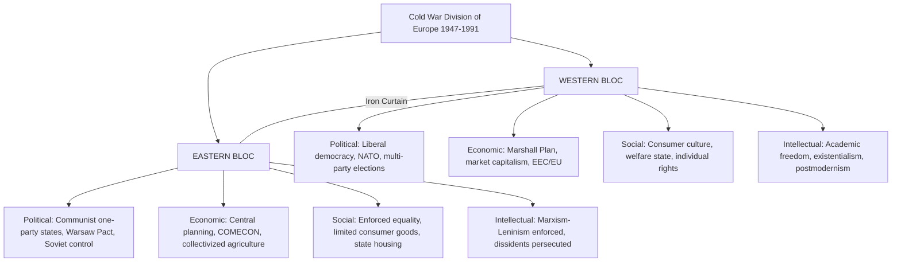

| Lens | Western Bloc | Eastern Bloc | Convergence Point |
|------|-------------|--------------|-------------------|
| Political | Multi-party democracy | One-party communist rule | Both suppressed radical opposition (McCarthyism / purges) |
| Economic | Market capitalism with welfare | Central planning | Both achieved postwar reconstruction, by different means |
| Social | Consumer individualism | Collective equality rhetoric | Both urbanized rapidly and expanded education |
| Religious | Freedom of religion (mostly) | State atheism, persecution | Both secularized over time |
| Intellectual | Academic freedom (with limits) | State-controlled ideology | Both invested heavily in science and technology |
| Technology | Consumer technology, space race | Military/space technology | Nuclear deterrence shaped both sides |
| Geography | Atlantic orientation, NATO | Continental/Eurasian, Warsaw Pact | Berlin: divided city as microcosm |

---

## Map 13: Cross-Unit Bridge Map

How AP units connect to each other. No unit exists in isolation.

```mermaid
graph LR
    u1["Unit 1: Renaissance and Exploration"]
    u2["Unit 2: Reformation"]
    u3["Unit 3: Absolutism and Constitutionalism"]
    u4["Unit 4: Scientific Revolution and Enlightenment"]
    u5["Unit 5: Revolutionary Era"]
    u6["Unit 6: Industrialization"]
    u7["Unit 7: Nationalism and Imperialism"]
    u8["Unit 8: World Wars and Totalitarianism"]
    u9["Unit 9: Cold War and Contemporary"]

    u1 -->|"Humanism provides tools for"| u2
    u1 -->|"Commercial Revolution funds"| u3
    u2 -->|"Religious wars demand"| u3
    u2 -->|"Sola scriptura models"| u4
    u3 -->|"State power provokes critique in"| u4
    u4 -->|"Enlightenment ideas fuel"| u5
    u5 -->|"Revolution disrupts, industrialization fills vacuum"| u6
    u5 -->|"Napoleonic wars spread nationalism"| u7
    u6 -->|"Industrialization creates class tensions and imperial motives"| u7
    u7 -->|"Imperial rivalries and nationalism cause"| u8
    u8 -->|"WWII outcome creates"| u9
    u6 -->|"Industrial inequality fuels socialist/communist ideology in"| u8
```

**Key AP skill:** The best long-essay responses show how causes in one unit produce effects in another. This map shows the most common bridges.

---

## Map 14: Causation Web (Major Cause-Effect Chains)

The longest causal chains in AP European History.

```mermaid
graph TD
    blackDeath["Black Death 1347"] --> laborShortage["Labor shortage empowers workers"]
    laborShortage --> commercialGrowth["Commercial growth, merchant class rises"]
    commercialGrowth --> renaissancePatronage["Patronage funds Renaissance art and thought"]
    renaissancePatronage --> humanism["Humanism: back to original sources"]
    humanism --> lutherMethod["Luther applies humanist method to Bible"]
    lutherMethod --> reformation["Reformation splits Christendom"]
    reformation --> religiousWars["Wars of Religion 1562-1648"]
    religiousWars --> westphalia["Peace of Westphalia: sovereignty principle"]
    westphalia --> stateSystem["Modern state system emerges"]
    stateSystem --> absolutism["Absolutism vs. constitutionalism debate"]
    absolutism --> enlightenmentCritique["Enlightenment critiques of absolute power"]
    enlightenmentCritique --> frenchRev["French Revolution 1789"]
    frenchRev --> napoleon["Napoleonic Wars spread nationalism"]
    napoleon --> nineteenthNat["19th-century nationalism"]
    nineteenthNat --> unification["German/Italian unification"]
    unification --> imperialRivalry["Imperial rivalries"]
    imperialRivalry --> ww1["World War I"]
    ww1 --> versailles["Versailles settlement"]
    versailles --> instability["Interwar instability"]
    instability --> ww2["World War II"]
    ww2 --> coldWarDivision["Cold War division"]
    coldWarDivision --> europeanIntegration["European integration as response"]
```

**Key insight:** This chain from the Black Death to the EU spans the entire AP curriculum. Being able to trace long causal chains is the highest-order skill the exam tests.

---

## Map 15: CCOT Bands (Change vs. Continuity by Unit)

What changed and what persisted in each major AP unit.

| AP Unit | Major Changes | Key Continuities |
|---------|--------------|-----------------|
| 1: Renaissance/Exploration | Secular art, classical revival, Atlantic trade, Columbian Exchange | Church remained dominant patron; feudal structures persisted; most people illiterate |
| 2: Reformation | Christianity splits, state churches, religious wars | Christian framework universal; women's status unchanged; peasant life largely same |
| 3: Absolutism/Constitutionalism | Centralized states, standing armies, Westphalian sovereignty | Aristocratic privilege continued; serfdom expanded in East; monarchy universal |
| 4: Scientific Rev./Enlightenment | Empirical method, natural rights theory, secular philosophy | Most people unaffected; religion remained central; monarchies persisted |
| 5: Revolutionary Era | Popular sovereignty, legal equality, nationalist ideology | Gender hierarchy persisted; colonial exploitation continued; property still = power |
| 6: Industrialization | Factory system, urbanization, working class, railroads | Agricultural sector remained large; rural poverty continued; elite political control |
| 7: Nationalism/Imperialism | Nation-states, colonial empires, mass politics | Great-power system continued; class hierarchy persisted; gender norms mostly stable |
| 8: World Wars | Total war, genocide, collapse of empires, totalitarianism | Nationalism persisted; state power grew further; colonial empires survived (briefly) |
| 9: Cold War/Contemporary | Decolonization, European integration, welfare state, 1989 | National identity persisted; economic inequality continued; security dilemmas remained |

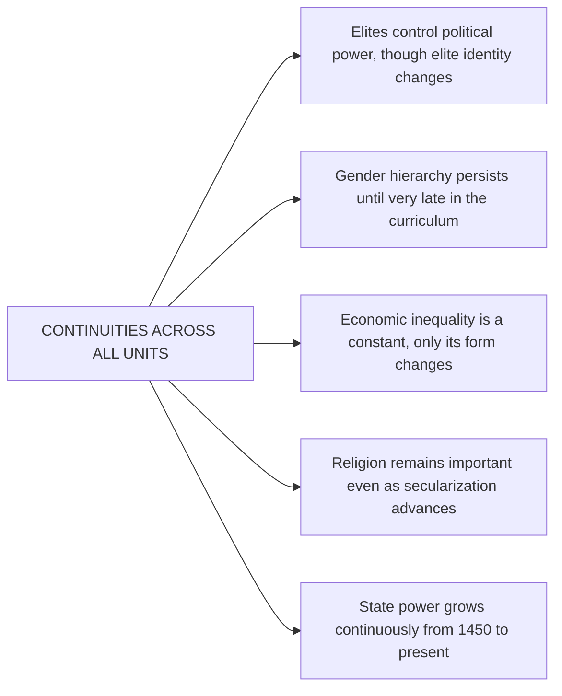

---

## Map 16: The Printing Press Cascade

How a single technology reshaped every Geo-SPRITE lens across multiple centuries.

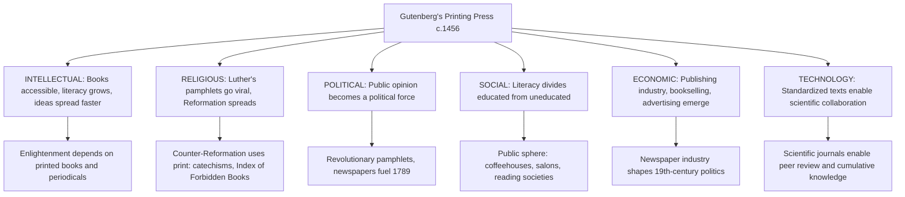

---

## Map 17: The Atlantic System Web

How the Atlantic economy connected four continents and reshaped European power.

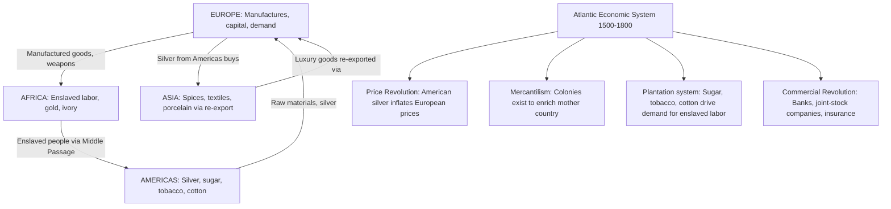

| Component | Geo-SPRITE Lens | AP Significance |
|-----------|----------------|-----------------|
| Silver flows | Economic/Geographic | Inflated European prices, destabilized Spain, funded Asian trade |
| Enslaved labor | Social/Economic | Central to plantation agriculture; not peripheral to European wealth |
| Plantation commodities | Economic/Technology | Sugar, tobacco, cotton transformed European consumption and industry |
| Mercantilist policy | Political/Economic | States competed for colonial advantage through trade regulation |
| Middle Passage | Social/Geographic | Largest forced migration in history; demographic catastrophe for Africa |

---

## Map 18: Women's History Through AP European History

How women's roles changed (and didn't change) across the curriculum.

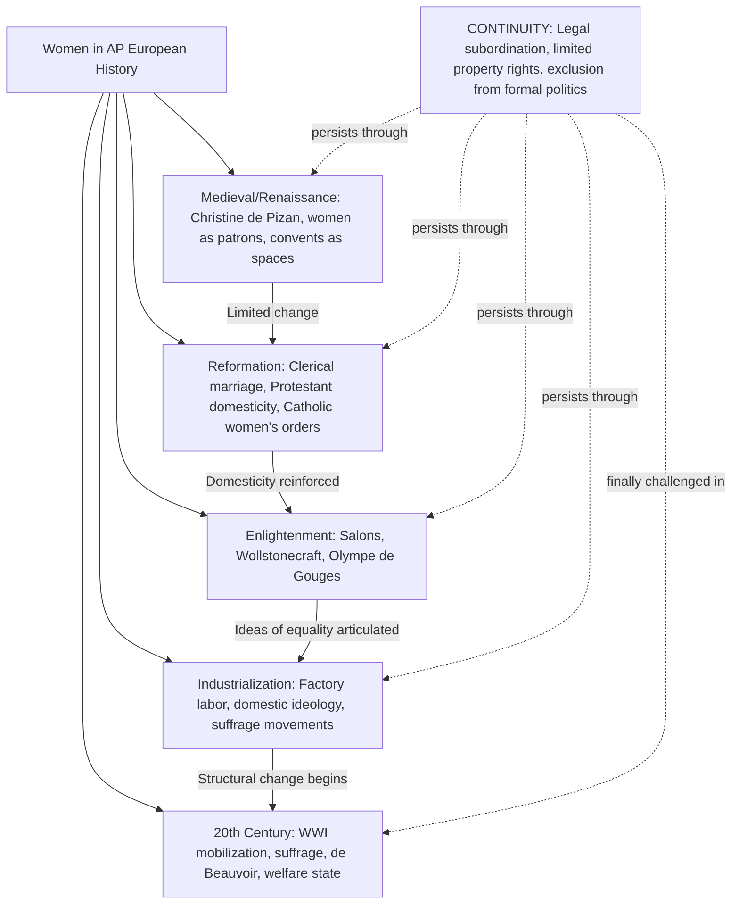

| Period | Key Figure/Event | What Changed | What Continued |
|--------|-----------------|--------------|----------------|
| Renaissance | Christine de Pizan | Elite women as patrons, writers | Legal subordination, no political rights |
| Reformation | Clerical marriage normalized | Protestant wives gain new domestic status | Women excluded from clergy, theology |
| Enlightenment | Wollstonecraft, salon hostesses | Intellectual participation argued | No legal or political rights gained |
| Industrial | Factory Acts, suffrage campaigns | Working-class women enter public labor force | Domestic ideology intensifies for middle class |
| 20th Century | WWI, suffrage, de Beauvoir | Voting rights, legal equality, workplace access | Pay gaps, care burdens, cultural expectations |

---

## Map 19: Revolutions Compared (1789, 1830, 1848, 1917)

Pattern analysis of European revolutions using Geo-SPRITE.

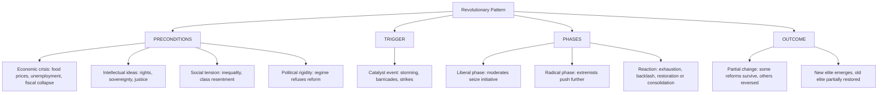

| Revolution | Economic Trigger | Social Base | Intellectual Framework | Outcome |
|-----------|-----------------|-------------|----------------------|---------|
| French 1789 | Fiscal crisis, bread prices | Bourgeoisie, urban poor | Enlightenment rights | Republic, then Napoleon |
| 1830 July | Post-war recession | Liberal bourgeoisie | Constitutional liberalism | Constitutional monarchy |
| 1848 | Crop failures, unemployment | Workers and middle class | Nationalism + liberalism | Mostly failed; serfdom ended in Austria |
| Russian 1917 | WWI strain, food shortages | Workers, soldiers, peasants | Marxism + war weariness | Communist dictatorship |

---

## Map 20: The European Integration Pathway

From postwar ruins to the European Union, mapped through Geo-SPRITE lenses.

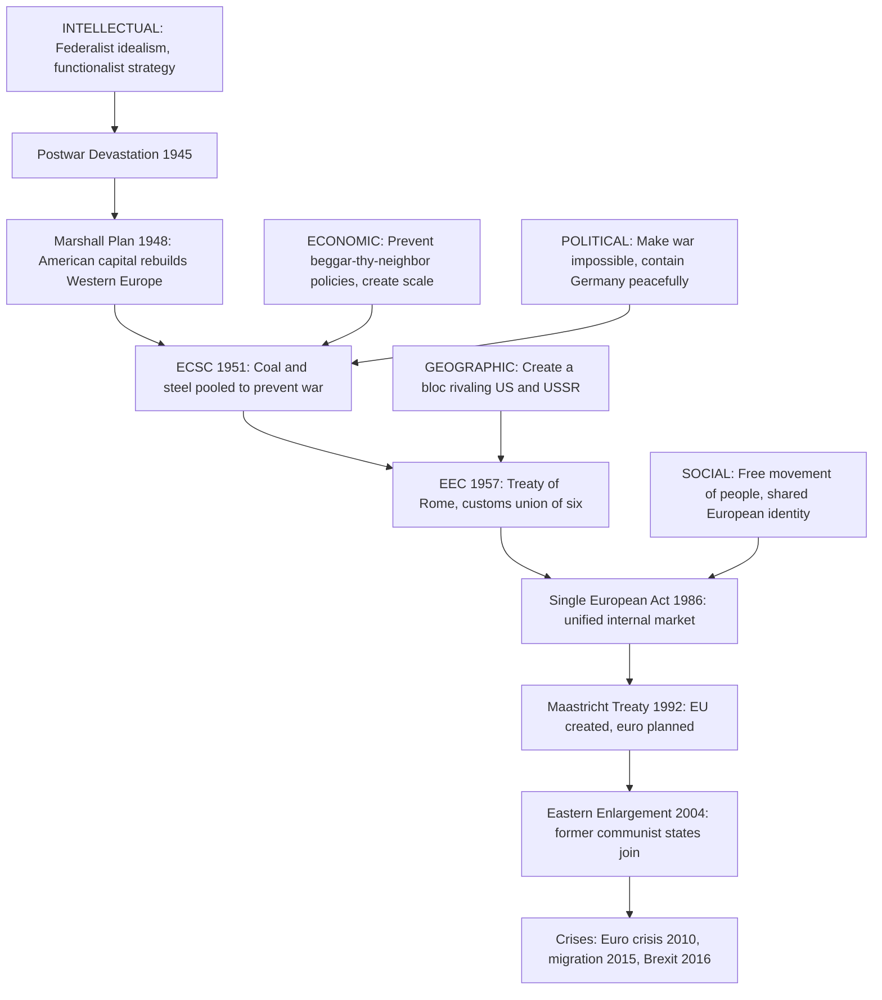

| Stage | Year | Geo-SPRITE Driver | Key Tension |
|-------|------|------------------|-------------|
| ECSC | 1951 | Economic + Political | Sovereignty vs. integration |
| EEC | 1957 | Economic + Geographic | National interest vs. common market |
| Single Act | 1986 | Economic + Social | Regulation vs. deregulation |
| Maastricht | 1992 | Political + Economic | Federal Europe vs. national sovereignty |
| Enlargement | 2004 | Geographic + Political | Rich West vs. poorer East |
| Crises | 2010s | Economic + Social | Austerity vs. solidarity; open borders vs. national control |

---

## Appendix: How to Read These Maps for AP Essays

**For causation prompts:** Follow the arrows. Identify which Geo-SPRITE lens provides the strongest causal link. Use a secondary lens for complexity.

**For comparison prompts:** Use the side-by-side tables. Pick two or three lenses where the comparison is sharpest. Avoid listing all seven lenses without analysis.

**For CCOT prompts:** Use Map 15's change/continuity bands as a starting framework. The most common AP mistake is describing only change without identifying what persisted.

**General rule:** One well-analyzed connection between two lenses beats a superficial tour of all seven. Depth over breadth.
